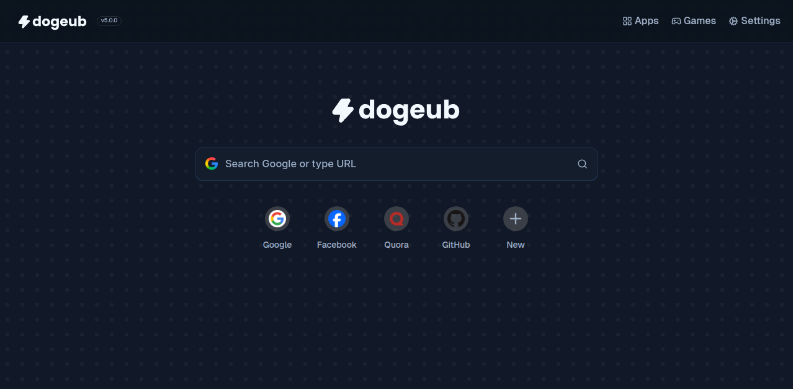

<div align="center">
  
  
  <br />

  [](https://ko-fi.com/I3I81MF4CH) 


  <hr />
  DogeUB version 5 is finally here!

  
  <br />
  <br />

  


</div>

## Overview

DogeUB is a browser-in-browser style internet hub that brings together web apps, tools, and games in one place, built with [React](https://github.com/facebook/react).

> [!IMPORTANT]
> Please consider starring our repository if you are forking it!

### List of features:

| Feature | Implemented |
|---------|-------------|
| Web Proxy | Yes |
| Browser-like UI | Yes |
| App player UI | Yes |
| Cloak features | Partially |
| Game Downloader | Yes |
| Quick Links | Yes |
| DuckDuckGo Search API | Yes |
| Apps & Games | Yes |
| Search Engine Switcher | Yes |
| Themes/Site Customization | Yes |

---

### Development & Building

#### Production:
```bash
git clone https://github.com/DogeNetwork/dogeub.git
cd dogeub
npm i
npm run build
node server.js
```

#### Development:

```bash
git clone https://github.com/DogeNetwork/dogeub.git
cd dogeub
npm i
npm run dev
```
---


### Run on your own machine

You only need a few things installed:
- **Node.js 20+** (recommended: latest LTS)
- **npm** (comes with Node.js)
- **git**

Quick start (production-style run):
```bash
git clone https://github.com/DogeNetwork/dogeub.git
cd dogeub
npm install
npm run build
node server.js
```
Then open: `http://localhost:2345` (or your configured `PORT`).

Local development mode (hot reload):
```bash
npm install
npm run dev
```
Then open the Vite URL shown in terminal (usually `http://localhost:5173`).


> [!TIP]
> If your environment is on Node.js 16 (common in older/dev containers), switch to Node 20 before installing deps:
> ```bash
> nvm install 20
> nvm use 20
> node -v
> ```

### Troubleshooting (Codespaces / CAPTCHA / "Robot" detections)

#### Change proxy mode (UI)

1. Open **Settings**.
2. Go to **Browsing** settings.
3. Find **Backend Engine**.
4. Choose:
   - **Scramjet only** (default)
   - **Ultraviolet only**
   - **Automatic**

If you run DogeUB inside **GitHub Codespaces**, some sites may repeatedly show bot checks or a reCAPTCHA spinner that never finishes.

Common reasons:
- **Datacenter IP reputation**: Codespaces egress IPs are often flagged by anti-bot systems.
- **Strict browser integrity checks**: Some providers detect proxy/service-worker flows and block challenge completion.
- **Cookie/storage restrictions**: CAPTCHA flows can fail if required storage/cookies are blocked or partitioned.
- **TLS / origin issues**: Make sure you are using the HTTPS URL provided by Codespaces port forwarding.

What to try:
1. Open the app from the forwarded **HTTPS** Codespaces URL (not plain localhost in another device/browser).
2. In Codespaces Port Forwarding, set the app port visibility to **Public** (or required mode for your usage).
3. Test in a clean browser profile with extensions/ad blockers disabled.
4. If CAPTCHA still loops, run on a different host/network with better IP reputation (self-hosted VPS/reverse proxy or local network).

> [!IMPORTANT]
> Some anti-bot pages are intentionally difficult or impossible to complete through proxy contexts. This is an upstream site security behavior, not always a build/runtime bug in DogeUB.

#### Where to test (recommended)

Use a two-environment check:
1. **Codespaces (repro check):** confirm whether the issue appears on `*.app.github.dev`.
2. **Non-Codespaces host (control check):** run the same build on local machine/VPS/custom domain to compare behavior.

If it fails only in Codespaces but works elsewhere, the root cause is usually platform/network reputation or Codespaces auth/cross-origin behavior rather than your project build.

### Put DogeUB on your own website

For a games site, the safest setup is a **separate subdomain** (recommended), e.g. `hub.yoursite.com`.

Why subdomain is better than a subpath:
- The app and service workers use root-style paths (e.g. `/portal/...`, `/ham/...`, `/sw.js`).
- Hosting under a subpath like `/games/dogeub/` usually requires extra rewrite work.

Recommended deployment pattern:
1. Build the app:
   ```bash
   npm install
   npm run build
   ```
2. Run the server behind a reverse proxy:
   ```bash
   PORT=2345 node server.js
   ```
3. Point a subdomain to your server and terminate HTTPS in Nginx/Caddy.

Example Nginx site block:
```nginx
server {
  listen 443 ssl http2;
  server_name hub.yoursite.com;

  location / {
    proxy_pass http://127.0.0.1:2345;
    proxy_set_header Host $host;
    proxy_set_header X-Forwarded-For $proxy_add_x_forwarded_for;
    proxy_set_header X-Forwarded-Proto $scheme;
  }
}
```

Then link to it from your main site with a normal link or iframe (link is usually more reliable).

#### CORS / CORP / COEP notes (Render)

Short answer: you usually **do not** need to add strict cross-origin policies for this proxy app.

Recommended for Render deploys:
- Keep default CORS behavior unless you have a specific API requirement.
- Do **not** force `Cross-Origin-Resource-Policy: same-origin` globally.
- Do **not** force `Cross-Origin-Embedder-Policy: require-corp` globally.
- Do **not** force `Cross-Origin-Opener-Policy: same-origin` globally.

Those strict headers can break proxied scripts/assets and challenge flows.

#### Deploying with Docker:

```bash
docker run -d \
  --name dogeub \
  --restart unless-stopped \
  -p 3000:3000 \
  -e NODE_ENV=production \
  -e PORT=3000 \
  ghcr.io/dogenetwork/dogeub:latest
```

> [!NOTE]
> If accessing over a network instead of localhost, you will need to provide a valid SSL certificate (e.g., using a reverse proxy like Nginx or Caddy). This is required for the built-in service worker to function properly.

#### HTTPS requirements (important)

- **`localhost` is OK without custom certs** for local testing.
- **Any non-localhost host** (LAN IP, VPS domain, school/work domain, etc.) should be served over valid **HTTPS** for reliable service-worker behavior.
- **Codespaces URLs are already HTTPS**, but can still hit platform auth/bot checks unrelated to your build.

Example Caddy reverse proxy (auto HTTPS):
```caddyfile
your-domain.example.com {
    reverse_proxy 127.0.0.1:2345
}
```

Then run DogeUB on localhost and let Caddy terminate TLS:
```bash
PORT=2345 node server.js
```

---

### Contributors / Developers

| Name          | Role               | GitHub |
| ------------- | ------------------ | ------ |
| Derpman | Lead Developer     |      [@qerionx](https://github.com/qerionx) |
| Fowntain | Project Manager | [@fowntain](https://github.com/fowntain)     |
| Akane | Contributor | [@genericness](https://github.com/genericness)     |
| DJshelfmushroom | Contributor | [@DJshelfmushroom](https://github.com/DJshelfmushroom)     |


> [!NOTE]
> Want to be on this list? Make a few pull requests!

---

### Made possible thanks to:

* [MercuryWorkshop/wisp-server-node](https://github.com/MercuryWorkshop/wisp-server-node)
* [MercuryWorkshop/scramjet](https://github.com/MercuryWorkshop/scramjet)
* [titaniumnetwork-dev/Ultraviolet](https://github.com/titaniumnetwork-dev/Ultraviolet)
* [lucide-icons/lucide](https://github.com/lucide-icons/lucide)
* [pmndrs/zustand](https://github.com/pmndrs/zustand)
* [Stuk/jszip](https://github.com/Stuk/jszip)

## License

This project is licensed under the **GNU Affero GPL v3**.  
See the [LICENSE](LICENSE) file for more details.
